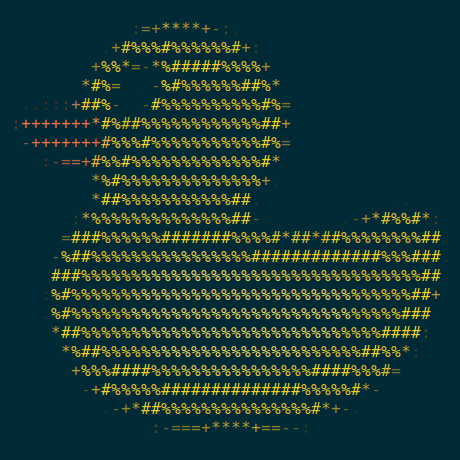

# DockDuck



[English](README.md)

码头鸭（DockDuck）为特定的 docker 镜像添加了开发工具包层，例如启动 openssh-server 和安装 gdbserver，并提供了一些脚本作为使用 docker 的快捷方式。

它具有以下特点：

- **支持在 docker 镜像中增添开发工具集构成 dock-duck 镜像（方便开发人员使用）**。
- **支持通过 SSH 协议登录 dock-duck 容器（用于远程开发、构建和调试）**。
- **支持以与主机相同的用户登录 dock-duck 容器（用于解决 root 用户引入的文件权限问题）**。
- **提供 dock-duck 工具集（封装了常用的 docker 命令行接口的傻瓜工具）**。

## 构建新的 DockDuck 镜像 

在 [duruyao/vimicro-ai](https://hub.docker.com/r/duruyao/vimicro-ai) 目录下有一些已经构建好的 dock-duck 镜像。

在构建前新镜像前根据你的需求修改 [Dockerfile](./Dockerfile) 。

```shell
bash path/to/DockDuck/build.sh [--name NEW_NAME] IMAGE
```

## 安装 DockDuck 工具集

下载适合你的操作系统的[发行版](https://github.com/duruyao/DockDuck/releases) （目前只支持类 UNIX 操作系统）

```shell
bash path/to/DockDuck/install.sh [DIRECTORT]
```

## 使用 DockDuck 工具集

使用 `dk -h` 或 `dk --help` 获取使用说明：

```shell
Usage: dk [OPTIONS] [COMMAND]

A shortcut for using dock-duck containers

Options:
  -h, --help                    Display this help message
  -v, --version                 Print version information and quit

Commands:
  attach                        Attach to a running dock-duck container
  detach                        Launch a new dock-duck container in the background
  ps                            List running dock-duck containers
  run                           Run a command in a new dock-duck container
  stop                          Stop one or more running containers

Run 'dk COMMAND --help' for more information on a command

See more about DockDucK at https://github.com/duruyao/DockDucK

```

## 卸载 DockDuck 工具集

```shell
bash path/to/DockDuck/uninstall.sh
```
